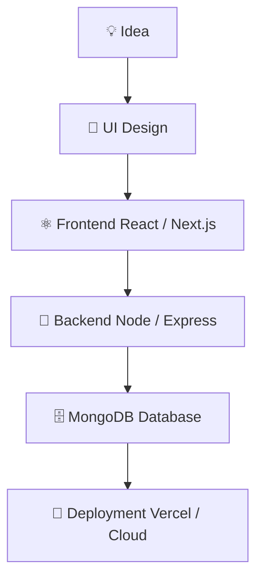

<!-- 🔥 HEADER ANIMATION --> <p align="center">  </p> <h1 align="center">Hi 👋, I'm MD. KAMRUL</h1> <h3 align="center">🚀 MERN Stack Developer | Real-Time Web App Builder</h3> <!-- 🔥 TYPING EFFECT --> <p align="center">
  
  
</p> --- 

<p align="center">
  
</p>

<div align="center">

💻 **MERN Stack Developer** *(MongoDB • Express • React • Node.js)*

🔥 Specialized in building **real-time applications**
*(chat systems • video call • tracking dashboards)*

🎯 Focused on **clean UI, performance & scalability**

⚡ Passionate about building **production-ready web apps**

</div>


## 🎨 Developer Style

<p align="center">
  
</p>


## ✨ What I Do

<p align="center">

  
  
  
  
  

  
  
  

  

  
  
  

</p>

---

## ⚡ Developer Mindset




---

## ⚙️ Developer Workflow
<p align="center">
  
</p>
```

---


```

        ↓
✨ UI Updates (Real-Time Feel)
--- ## 🚀 Tech Stack <p align="center">  <br/>  </p> --- ## 🛠️ Tools & Technologies <p align="center">      </p>

 ---

## 📊 GitHub Stats

 <p align="center">  <br/>  </p> --- ## 🔥 Featured Project <p align="center">  </p> ### 📱 Close Friends App * 📞 Call / Video / Text tracking system * 📊 Real-time contact stats * ⚡ Built with MERN Stack --- ## 🧠 Currently Learning * ⚛️ Advanced React Patterns * 🌐 Next.js Fullstack * 🔐 Authentication & Security * ⚡ Performance Optimization --- ## 🌐 Connect With Me <p align="center"> <a href="#"></a> <a href="#"></a> <a href="#"></a> </p> --- ## 👀 Profile Views <p align="center">  </p> --- <h3 align="center">✨ "Code. Create. Innovate." ✨</h3> <!-- 🔥 FOOTER ANIMATION --> <p align="center">  </p>
